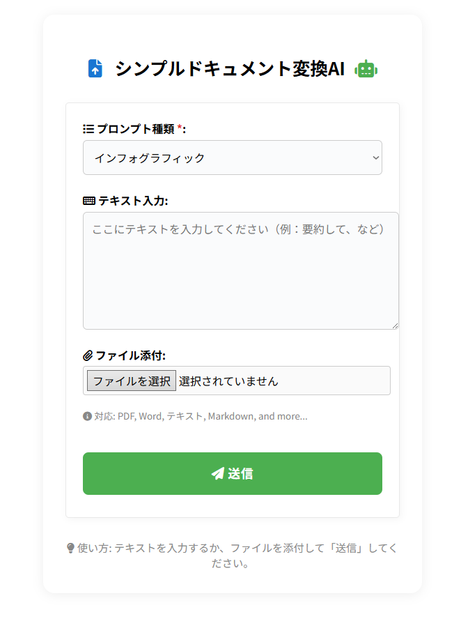

# Local LLM Prompt App



A lightweight FastAPI web app that lets you paste text, upload files, or record audio,
then pick a preset prompt to send everything to OpenAI GPT‑4.1 or Gemini 2.5 Pro.  
Responses are saved to timestamped Markdown **or** HTML files, depending on the preset.

## Quick start (Windows PowerShell)

```ps1
python -m venv .venv
.venv\Scripts\Activate.ps1
pip install -r requirements.txt
copy .env.example .env   # add your GEMINI_API_KEY
uvicorn app.main:app --reload
```

Open <http://127.0.0.1:8000/> in your browser.

## Folder layout

```
text_app/
├── app/
│   ├── main.py
│   ├── prompt_loader.py
│   ├── llm_client.py
│   ├── file_utils.py
│   ├── whisper_client.py
│   ├── templates/
│   │   └── index.html
│   └── static/
│       └── app.js
├── prompts.yaml
├── .env.example
└── requirements.txt
```

## Acknowledgements

The prompt design for this project was originally based on and adapted from the prompt shared by [hAru_mAki_ch](https://x.com/hAru_mAki_ch/status/1898431078626714104).  
Many thanks for the valuable inspiration.
